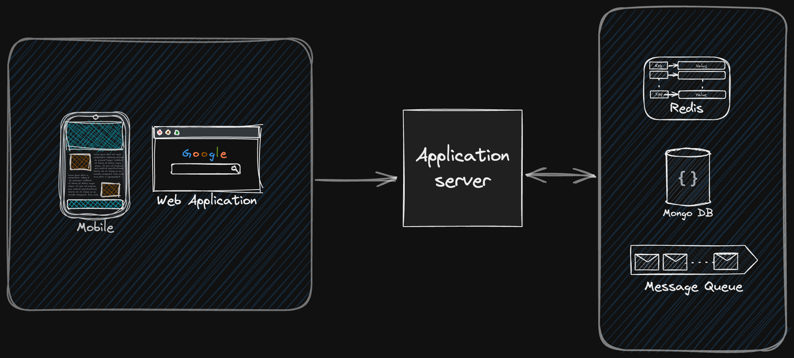
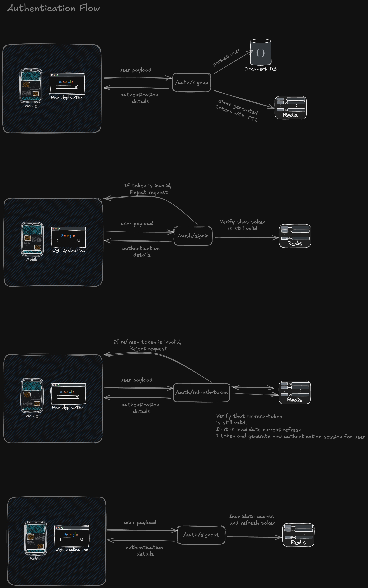
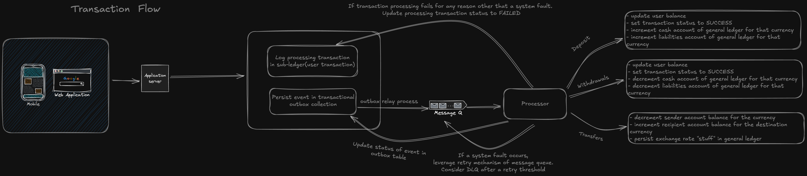

# The Ledger

This document provides an overview of the backend project design, key architectural decisions, and instructions for running the application and tests.

## Table of Contents

- [Overview](#overview)
- [System Architecture](#system-architecture)
- [System Design](#system-design)
  - [Account Management](#account-management)
  - [Authentication and Token Handling](#authentication-and-token-handling)
  - [Transaction Operations](#transaction-operations)
  - [General Ledger Implementation](#general-ledger-implementation)
- [Diagrams](#diagrams)
- [Running the Application](#running-the-application)
- [Running Tests](#running-tests)
- [Conclusion](#conclusion)

## Overview


The system is designed to handle user account management and transaction operations in a scalable, modular, and resilient manner. Key functionalities include:

- **User Management:**
  Users can sign up, sign in, sign out, and refresh authentication tokens. User profiles store essential details (first name, last name, email, optional phone) along with an activity log.
  

- **Transaction Operations:**  
  Users can perform deposits, withdrawals, and transfers. Each account is dedicated to a specific currency, supporting account-to-account transfers and reducing cache invalidation overhead. Transactions are processed using a transactional outbox pattern for atomicity.

- **General Ledger:**  
  The General Ledger (GL) captures all financial movements as journal entries, ensuring that every transaction (deposit, withdrawal, transfer) updates both user account balances and corresponding GL accounts atomically.
  

## System Architecture

The project follows a **Clean/Hexagonal Architecture (Ports and Adapters)**, which decouples core business logic from external dependencies:

- **Domain Layer:**  
  Contains core business logic, domain entities (e.g., User, Account, Transaction, GL Account, GL Transaction), value objects (e.g., Money, Token), and repository interfaces.

- **Application Layer:**  
  Implements use cases (e.g., user sign-up, transaction processing, reconciliation) that orchestrate interactions between the domain and the infrastructure adapters.

- **Adapters (Infrastructure) Layer:**

  - **HTTP Adapters:** Express controllers, routes, and middleware expose REST endpoints (e.g., `/auth/signup`, `/user/transactions/deposit`).
  - **Persistence Adapters:** Mongoose models and repository implementations manage data storage for users, accounts, transactions, and GL entries.
  - **Messaging Adapters:** Redis-based messaging (both for token caching and message queuing using Redis Streams with consumer groups) supports asynchronous processing.
  - **External Integrations:** Handle external services like exchange rate APIs.

- **Configuration and Deployment:**  
  Environment variables and Docker Compose are used for configuration and local development, while Docker is used to containerize the application and its dependencies.

## System Design

### Account Management

- **Design Considerations:**  
  User accounts are managed separately from user profiles to support account-to-account transfers, reduce cache invalidation, and simplify schema evolution. Each account is dedicated to a specific currency and includes a unique account number.

- **Data Model:**
  - **User Entity:** Contains personal details and an activity log.
  - **Account Entity:** Contains `userId`, `currency`, and balance states (available, pending deposits, pending withdrawals, pending transfers). Monetary values are represented as integers (minor units) via a custom `Money` value object.

### Authentication and Token Handling

- **Token Strategy:**  
  Authentication tokens are random strings (access and refresh tokens) stored in Redis, avoiding JWT revocation issues. A combined token value object encapsulates both token types and manages expiration timestamps.

### Transaction Operations

- **Supported Operations:**  
  Users can perform deposits, withdrawals, and transfers.

  - **Design:**  
    Transactions are processed using a transactional outbox pattern. A sub-ledger transaction is created in a processing state and an event is written to an outbox. An asynchronous process publishes these events via a message queue (using Redis Streams with consumer groups) for further processing.

- **Processing Flow:**
  - **Deposits:** Increase user balance and update GL cash/liability accounts.
  - **Withdrawals:** Decrease user balance and update GL cash/liability accounts.
  - **Transfers:** Adjust sender and receiver balances accordingly.

### General Ledger Implementation

- **General Ledger Accounts:**  
  Represent financial accounts (e.g., Cash, Liability) per currency.
- **GL Transactions (Journal Entries):**  
  Record each financial operation with debit/credit entries, transaction type, amounts, and metadata.
- **Atomic Updates:**  
  GL updates occur atomically with user account operations via MongoDB transactions, ensuring consistency.

## Diagrams

### Architecture Diagram

```mermaid
graph LR
    A[Client (Web/Mobile)] --> B[API Gateway]
    B --> C[Auth & Account Service]
    C --> D[(User Database)]
    C --> E[(Redis - Token Cache)]
    B --> F[Transaction Service]
    F --> G[(MongoDB - Transactions, Accounts)]
    G --> H[Transactional Outbox]
    H --> I[Message Queue (Redis Streams)]
    I --> J[External Processing / Reconciliation]
```

### Entity Relation Diagram

